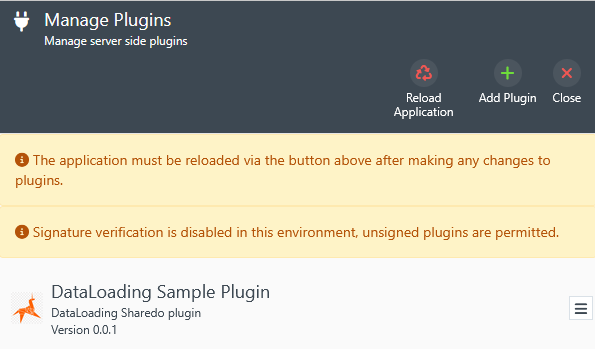

# data-loading-extensibility
Example plugin showcasing extensibility in the ShareDo data loading framework.

There is a custom loader for the existing core "People" scope, and an entirely new scope "Bank Details", which has validation, a matching step and loader.


## Setup
Create the source.bankDetails table in your source database

```
create table source.bankDetails (
	reference nvarchar(200) primary key,
    matchUniqueId uniqueidentifier null,
    odsReference nvarchar(200) not null,
    friendlyName nvarchar(250) null,
    accountHoldersName nvarchar(250) null,
    bankName nvarchar(100) null,
    bankSwiftBic nvarchar(100) null,
    createdDate datetime not null,
    isBusinessAccount bit not null
)
```

Build the plugin using the ShareDo PluginTool and then install in ShareDo



Provision the source data for ods entities, people and bank details using the sql below

```
declare @qty int = 100
declare @cnt int = 0

while @cnt <= @qty
begin 
    declare @batchPos int = 0
    declare @reference nvarchar(100) = 'ref-' + format(@cnt, '000000')

    insert into source.ods (reference, name, type)
    values (@reference, 'Mr John Smith', 'person')

    insert into source.person (odsReference, title, gender, firstname, surname, middlenameOrInitial, dateOfBirth, dateOfDeath, niNumber,
        employeeCode, primaryTeamId, externalReference, contactHoursFrom, contactHouseTo, preferredContactDetailsReference, personReference)
    values (
        @reference, 'Mr', 'male', 'John-' + cast(@cnt as nvarchar), 'Smith', null, '01 January 1980', '01 January 2024', 'QQ 12 34 56 A',
        'employ-' + cast(@cnt as nvarchar), null, 'extref-' + cast(@cnt as nvarchar), '09:00', '17:00', null, 'peref-' + cast(@cnt as nvarchar))

    insert into source.bankDetails (reference, odsReference, matchUniqueId, friendlyName, accountHoldersName, bankName, bankSwiftBic, createdDate, isBusinessAccount)
    values
        ('ref-bd-' + cast(@cnt as nvarchar(10)), @reference, null, 'Mr John Smith Personal', 'Mr John Smith', 'Banklyfried', 'ABCDUK01999', getutcdate(), 0)

    set @cnt = @cnt+1
end
```
Create a new dataload with the Ods, People and Bank Details scopes


The bank details scope has the steps and validators


Complete the load and the people with bank details will be added to ShareDo, you can confirm this by viewing the new people in ods admin (ensure that the bank details aspect has been added to person ods type).

